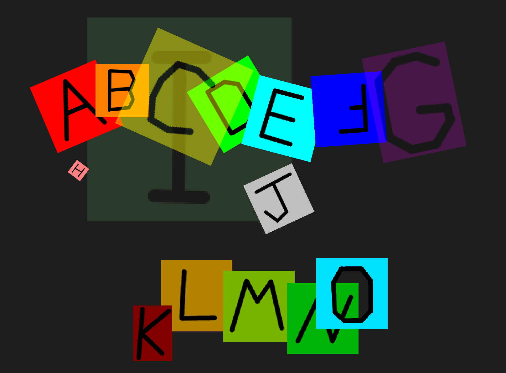

# alnview - multi image viewer
****alnview**** is a tool for quickly viewing, arranging, aligning, and overlaying multiple images on a canvas. 

Positioning, zooming, draw order, opacity, cropping, browsing, and rotation (of both the images and the canvas) are supported, as well as hotkeys to jump between canvas views, saving the current setup, and more.

In particular, you can zoom and rotate images about any arbitrary point, which makes alignment of images easy, and is something that seems to be missing from similar tools.

You might find this program similar to [Feh](https://github.com/derf/feh), [PureRef](https://www.pureref.com/), and [BeeRef](https://beeref.org/), or Google Earth and other similar mapping tools.

