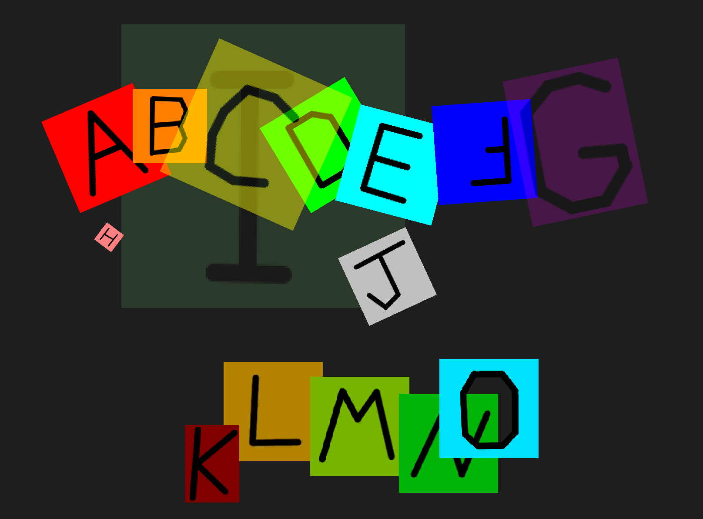

# Alnview - multi image viewer
****Alnview**** is a tool for quickly viewing, arranging, aligning, and overlaying multiple images on a canvas. 



Positioning, zooming, draw order, transparency, opacity, cropping, browsing, and rotation (of both the images and the canvas) are supported, as well as hotkeys to jump between canvas views, saving the current setup, and more.

In particular, you can zoom and rotate images about any arbitrary point, which makes alignment of images easy, and is something that seems to be missing from similar tools.


It also makes a good document viewer, much better than any PDF reader especially for scanned manuals which have schematics or other diagrams spanning multiple pages (this was the original use case I had in mind). IPages take no time to load, as they are already loaded (but must be converted to images first ahead of time).


It supports quite extreme levels of zoom, and is great for just messing around.


### What's the catch?
All loaded images are stored uncompressed in RAM, which makes it very fast, but also very RAM heavy. On Windows, loading 101 PNGs of document scans at 300 DPI totaling 107MB, it takes more than 6GB of RAM. Even loading a bunch of BMPs comes in at about double the size they are on disk. It may be worth it to manually downscale your images first before loading them. But, this is why you have 32GB ram in your PC, right?

You might find this program similar to [Feh](https://github.com/derf/feh), [PureRef](https://www.pureref.com/), and [BeeRef](https://beeref.org/), if not Google Earth and other similar mapping tools.


Alnview is built on [SDL2](https://www.libsdl.org/), so it can load all the image file types that ```IMG_Load()``` knows about. This is at least PNG, JPG, WebP, BMP, TIFF, and GIF.


The included font.ttf is one of the [dejavu fonts included with Linux Mint](https://dejavu-fonts.github.io/), but any should work.

# Building
## Linux
Ubuntu / Debian based

```
sudo apt-get update
sudo apt-get install gcc libsdl2-dev libsdl2-image-dev libsdl2-ttf-dev git make
git clone https://github.com/alnwlsn/alnview
cd alnview
make clean
make
./alnview img
```

## Windows
[MSYS2](https://msys2.org) + [MinGW](https://en.wikipedia.org/wiki/MinGW) seems to work well

[Install MSYS2](https://www.msys2.org/#installation), then:

MSYS shell
```
pacman -Syu
pacman -Su
pacman -S mingw-w64-x86_64-gcc \
          mingw-w64-x86_64-SDL2 \
          mingw-w64-x86_64-SDL2_image \
          mingw-w64-x86_64-SDL2_ttf \
          git make
```

MINGW64 shell
```
git clone https://github.com/alnwlsn/alnview
cd alnview
make clean
make
./alnview.exe img
```

# Controls
Alnview is key driven, and has minimal GUI elements to maximize the amount of image visible on screen. Besides the images themselves, the only on-screen elements are small pointers which indicate certain points (like the corners of the selected image), and text overlays (where applicable).

| Control  | Action | Selects image using
| ------------- | ------------- | ------------- |
| ```left click + drag``` | pan canvas 
| ```middle click + drag``` | drag rotate image | last selection
| ```right click``` | select image | mouse pointer 
| ```right click + drag``` | move (translate) image | mouse pointer
| ```scroll wheel``` | zoom canvas about mouse pointer
| ```shift``` | show image corners and image reference point | last selection
| ```shift + left click``` | select reference point for image | last selection
| ```shift + middle click + drag``` | drag rotate image about image reference point | last selection
| ```shift + right click + drag``` | drag zoom image about image reference point | last selection
| ```shift + scroll wheel``` | zoom image about image reference point | last selection
| ```ctrl``` | show center of screen
| ```ctrl + middle click + drag``` | drag rotate canvas about center of screen
| ```ctrl + right click + drag``` | move (translate) image | last selection
| ```ctrl + scroll wheel``` | zoom image under mouse pointer about mouse pointer | mouse pointer (temp)
| ```tab``` | show canvas reference point
| ```tab + left click``` | select reference point for canvas
| ```tab + middle click + drag``` | drag rotate canvas about canvas reference point
| ```tab + right click + drag``` | drag zoom canvas about canvas reference point
| ```tab + scroll wheel``` | zoom canvas about canvas reference point