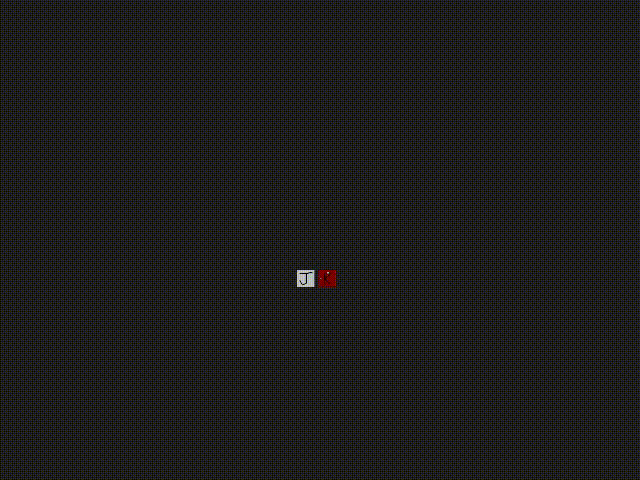

# Alnview - multi image viewer
****Alnview**** is a tool for quickly viewing, arranging, aligning, and overlaying multiple images on a canvas. 


Positioning, zooming, draw order, transparency, opacity, cropping, browsing, and rotation (of both the images and the canvas) are supported, as well as hotkeys to jump between canvas views, saving the current setup, and more.

In particular, you can zoom and rotate images about any arbitrary point, which makes alignment of images easy, and is something that seems to be missing from similar tools.



It also makes a good document viewer, much better than any PDF reader especially for scanned manuals which have schematics or other diagrams spanning multiple pages (this was the original use case I had in mind). Pages take no time to load, as they are already loaded (but must be converted to images first ahead of time).


It supports quite extreme levels of zoom, and is great for just messing around.


### What's the catch?
All loaded images are stored uncompressed in RAM, which makes it very fast, but also very RAM heavy. On Windows, loading 101 PNGs of document scans at 300 DPI totaling 107MB, it takes more than 6GB of RAM. Even loading a bunch of BMPs comes in at about double the size they are on disk. It may be worth it to manually downscale your images first before loading them. But, this is why you have 32GB ram in your PC, right?

You might find this program similar to [Feh](https://github.com/derf/feh), [PureRef](https://www.pureref.com/), and [BeeRef](https://beeref.org/), if not Google Earth and other similar mapping tools.


Alnview is built on [SDL2](https://www.libsdl.org/), so it can load all the image file types that ```IMG_Load()``` knows about. This is at least PNG, JPG, WebP, BMP, TIFF, and GIF.


The included font.ttf is one of the [dejavu fonts included with Linux Mint](https://dejavu-fonts.github.io/), but any should work.

# Building
## Linux
Ubuntu / Debian based

```
sudo apt-get update
sudo apt-get install gcc libsdl2-dev libsdl2-image-dev libsdl2-ttf-dev git make
git clone https://github.com/alnwlsn/alnview
cd alnview
make clean
make
./alnview img
```

## Windows
[MSYS2](https://msys2.org) + [MinGW](https://en.wikipedia.org/wiki/MinGW) seems to work well

[Install MSYS2](https://www.msys2.org/#installation), then:

MSYS shell
```
pacman -Syu
pacman -Su
pacman -S mingw-w64-x86_64-gcc \
          mingw-w64-x86_64-SDL2 \
          mingw-w64-x86_64-SDL2_image \
          mingw-w64-x86_64-SDL2_ttf \
          git make
```

MINGW64 shell
```
git clone https://github.com/alnwlsn/alnview
cd alnview
make clean
make
./alnview.exe img
```

# Usage
```alnview [DIRECTORY]```

This will attempt to load all images in the directory. It does not traverse subfolders. If no directory is specified, then the current directory is used. 

If there is a ```view.aln``` savefile present, it will use it. If a savefile is created with ```S```, it will be stored in the directory as this file. The savefile contains image positioning, and canvas views.

On Windows, it works to drag a folder onto ```alnview.exe```.

# Controls
Alnview is key driven, and has minimal GUI elements to maximize the amount of image visible on screen. Besides the images themselves, the only on-screen elements are small markers which indicate certain points (like the corners of the selected image), and text overlays (where applicable).

Operations on images chooses the image to affect in a few ways:
- **last** - uses the last selected image
- **mouse** - uses the image under the mouse pointer. After the operation, it will become the last image selected
- **mouse (temporary)** - temporarily uses the image under the mouse pointer, but does not change the last selected image 
- **mouse or last** - uses the image under the mouse, or if it is not on an image, uses the last selection
- **next** - the last selected image becomes the one that is jumped to after finishing the operation

| Control  | Action | Selects image using
| ------------- | ------------- | ------------- |
| ```left click + drag``` | pan canvas 
| ```middle click + drag``` | drag rotate image about image reference point | last
| ```right click``` | select image | mouse
| ```right click + drag``` | move (translate) image | mouse
| ```scroll wheel``` | zoom canvas about mouse pointer
| ```[square brackets]``` | incrementally rotate canvas about center of screen
| ```shift``` | show image corners and image reference point mark | last
| ```shift + left click``` | select reference point for image | last
| ```shift + middle click + drag``` | drag rotate image about image reference point | last
| ```shift + right click + drag``` | drag zoom image about image reference point | last
| ```shift + scroll wheel``` | zoom image about image reference point | last
| ```shift + [square brackets]``` | incrementally rotate image about image reference point
| ```ctrl``` | show center of screen mark
| ```ctrl + middle click + drag``` | drag rotate canvas about center of screen
| ```ctrl + right click + drag``` | move (translate) image | last
| ```ctrl + scroll wheel``` | zoom image under mouse pointer about mouse pointer | mouse (temporary)
| ```tab``` | show canvas reference point mark
| ```tab + left click``` | select reference point for canvas
| ```tab + middle click + drag``` | drag rotate canvas about canvas reference point
| ```tab + right click + drag``` | drag zoom canvas about canvas reference point
| ```tab + scroll wheel``` | zoom canvas about canvas reference point
| ```tab + [square brackets]``` | incrementally rotate canvas about canvas reference point
| ```space``` | select image + show corners | mouse
| ```O``` | reset canvas rotation to 0
| ```P``` | reset canvas zoom to 1
| ```' (single quote)``` | reset image zoom to 1 | mouse (temporary) or last
| ```; (semicolon)``` | snap image rotation to nearest 90 | mouse or last
| ```, (comma)``` | send image to back | last
| ```. (period)``` | bring image to front | last
| ```R``` | rotate image by 90 clockwise | mouse or last
| ```/ (forward slash)``` | reset image reference point to center of image | last
| ```(backtick)``` | zoom and pan canvas to fit all images on screen
| ```V``` | center view on image | last
| ```enter``` | center on image and zoom view to fit screen | mouse or last
| ```page up``` | center view on previous image in series | next
| ```page down``` | center view on next image in series | next
| ```[arrow keys]``` | center view on nearest image in direction | next
| ```Z``` | decrease image opacity | last
| ```X``` | increase image opacity | last
| ```C (+ optional hold)``` | crop image (nearest edge or corner to mouse pointer) | last
| ```G``` | uncrop image | last
| ```W``` | reload all images from disk
| ```E``` | reload single image from disk | mouse or last
| ```S``` | create/update save file (save setup)
| ```D``` | enters '''draw mode (see below)'''
| ```F``` | pick pen for drawing
| ```F11``` | toggle full screen mode
| ```shift + [numbers 0-9]``` | set current canvas view as preset
| ```[numbers 0-9]``` | jump to previously set canvas view preset
| ```shift + Q``` | quit program (does not save on exit)

## Draw Mode

To make it easier to draw with a pen, a separate mouse map is used when draw mode (```D```) is selected.

| Control  | Action 
| ------------- | ------------- |
| ```escape``` | exit draw mode (return to normal mode)
| ```left click + drag``` | free draw with currently selected pen
| ```middle click + drag``` | pan canvas
| ```right click + drag``` | draw straight line from last drawn point
| ```space + hold``` | pick pen for drawing. Opens a menu at the top right of the screen. Mouseover what you want, then release space.
| ```enter``` | drop and lift up pen (makes dot, sets position for right click lines)
| ```[backspace]``` | delete last pen stroke
| ```shift + [backspace]``` | undelete last pen stroke


# Other notes
(not nessacarily related to Alnview)
* To convert a PDF to a bunch of images on Linux:

    ```pdftoppm -r 200 -png *.pdf page```

    Makes a bunch of PNGs at 200 DPI: page-001.png, page-002.png, etc.
